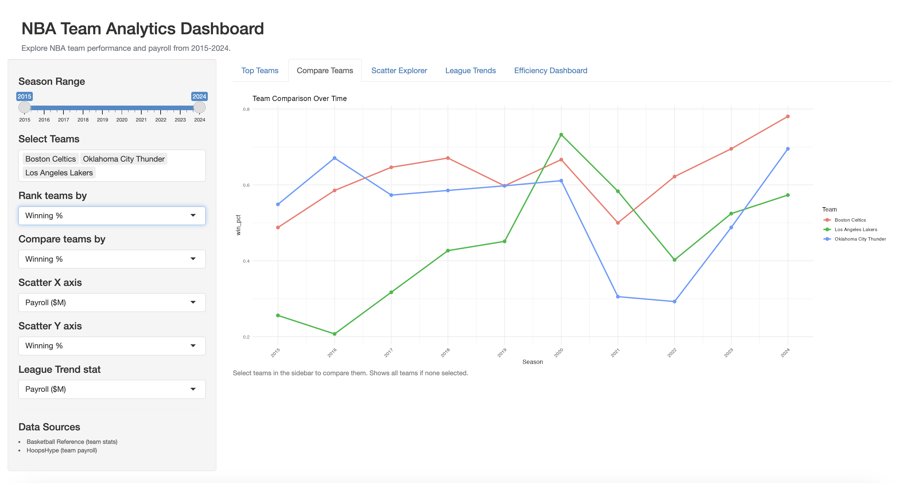

```{r setup, include=FALSE}
knitr::opts_chunk$set(echo = FALSE, message = FALSE, warning = FALSE)
library(ggplot2)
library(dplyr)
library(scales)

nba = read.csv("../../data/clean/nba_data.csv", stringsAsFactors = FALSE)
nba$payroll_M <- nba$payroll / 1e6
```

---

# Goal and Intended Audience

The goal of this project was to build an interactive dashboard where users can explore NBA team performance and payroll data from 2015 to 2024. Instead of just showing a fixed set of charts, I wanted users to be able to pick which teams they care about, choose which stats to compare, and filter by season so they can ask their own questions rather than just looking at whatever I decided to plot.

The main audience is basketball fans and anyone curious about how team spending relates to winning. I also tried to make it usable for someone who doesn't follow the NBA closely, so all the dropdowns use plain English labels like "Offensive Rating" instead of "ortg" and the data sources are listed in the sidebar so it's clear where the numbers come from.

Honestly the reason I went with a dashboard instead of more static charts is that the data has 30 teams across 10 seasons and a lot of different variables, so there's no way a handful of fixed plots could cover everything interesting in it.

---

# Why I Chose This Approach

For Stage 3 I went with Option B and built a Shiny app. Shiny was on the suggested challenge list and I had never used it before since we didn't cover it in class. It seemed like the right fit because the whole point of my data is exploring relationships between different team stats, and an interactive tool is way better for that than a PDF with six charts in it.

Learning Shiny was harder than I expected at first. The biggest thing I had to get used to was that it doesn't just run top to bottom like a normal R script. You have to think about which parts of your code should re-run when the user changes something and which parts only need to run once. Once that clicked it got a lot easier, but it took me a while to wrap my head around it.

---

# Data

The dashboard uses the same cleaned dataset from Stage 2. It pulls from two sources:

- **Basketball Reference** (https://www.basketball-reference.com): team stats for all 30 NBA teams from 2014-15 through 2023-24, including wins, losses, offensive rating, defensive rating, pace, three-point attempt rate, and true shooting percentage.

- **HoopsHype** (https://hoopshype.com/salaries/teams/): total team payroll by season. The raw data is in dollars so I converted it to millions to make it more readable on plots.

After cleaning and merging everything in Stage 2, the final dataset has 300 rows, one per team per season, and 17 variables. I just load the cleaned CSV in the app so none of the data wrangling has to run again inside Shiny.

---

# Dashboard Preview



---

# Dashboard Features and Design Choices

The app has five tabs. All of them share a sidebar with a season range slider and a team multi-select dropdown, so you can set your filters once and they carry across every tab. The sidebar also has separate dropdowns for each tab's specific controls: which stat to rank by, which stat to compare, the X and Y axes for the scatter, and which stat to track over time.

## Top Teams

This tab shows a horizontal bar chart of the top 10 teams by the stat selected in the "Rank teams by" dropdown. The app averages each team's stat across the selected season range and then takes the top 10. I made it horizontal because team names are long and they get really cramped on a vertical bar chart.

The four options are winning percentage, payroll in millions, offensive rating, and defensive rating. This tab came directly from peer review feedback where my reviewer said it would be useful to have a quick ranked view of teams by different stats.

## Compare Teams

This tab shows a line chart with one line per team, plotting the selected stat over time across seasons. If you've selected specific teams in the sidebar it filters down to just those, otherwise it shows all 30 teams at once. The x-axis ticks are rotated so the season years don't overlap.

This is useful for seeing trends over time, like whether a team's offensive rating has improved or whether their payroll has grown. The "Compare teams by" dropdown controls which stat shows on the y-axis.

## Scatter Explorer

This is probably the most useful tab. The user picks both the X and Y axis variables from the sidebar so they can plot any two stats against each other. Each point is one team-season, so there are 300 points total across the full date range. If you've selected teams in the sidebar those points show up in blue and the rest are grayed out and smaller, so you can spot your teams without the other points disappearing completely.

There's always a linear regression line with a shaded confidence interval so you can see the overall trend. Being able to swap the axes freely makes this a lot more flexible than the fixed scatter plots from Stage 2.

## League Trends

This tab tracks any stat across the whole league from 2015 to 2024. The solid line is the league average each season and the shaded band goes from the minimum to the maximum across all teams. I added the ribbon because just showing the average hides a lot of interesting variation, and you can sometimes see the spread narrowing or widening over time which tells you something about how the league is changing.

## Efficiency Dashboard

This tab shows four scatter plots in a 2x2 grid: offensive rating, defensive rating, true shooting percentage, and three-point attempt rate, all plotted against winning percentage. Each panel has its own color scheme and a regression line so you can see which metric has the strongest relationship with winning.

I used a helper function called `eff_plot()` in the server to avoid repeating the same ggplot code four times. The function takes the variable name, title, and colors and returns the finished plot, then I just call it once for each of the four panels.

---

# Methods and Technical Details

## Shiny Structure

A Shiny app has two parts: the UI and the server. The UI is just the layout, what the user sees and where the plots go. The server is where all the actual R code runs. I kept them in a single file called `NBA_App.R` but with the UI and server clearly separated so it's easy to tell which part does what.

The main thing I had to learn was reactivity. I used `reactive()` to create a filtered version of the dataset called `dat()` that automatically re-runs whenever the season slider changes. Every `renderPlot()` call that uses `dat()` re-renders automatically when that happens, so I only had to wire up the filter logic once.

## Code Reuse

For the Efficiency Dashboard I wrote a helper function called `eff_plot()` instead of copy-pasting the same ggplot code four times. It takes the variable name, chart title, and three color arguments and returns the finished plot. Then I just call it once per panel. This is the same idea as what we covered in the Programming lecture about writing functions to avoid repeating yourself.

## Visualization Principles

I tried to apply what we learned in class throughout the app:

- Every plot has a title, axis labels, and at least the efficiency plots include a data source caption.
- I used `theme_minimal()` as the base for all plots so they have a consistent look.
- Colors are used meaningfully: blue (`#2166ac`) for highlighted teams and gray for background ones in the scatter, and each efficiency panel has its own distinct color scheme.
- The Efficiency Dashboard formats the y-axis as a percentage using `percent_format()` from the scales package so it reads more naturally than raw decimals.

---

# Challenge: Learning Shiny

Shiny was my challenge for this project. I hadn't used it before and it isn't covered in any of the lectures. I mostly learned it by going through the official documentation at https://shiny.posit.co/r/getstarted/ and then just building the app one tab at a time and figuring things out as I went.

The hardest part was honestly just understanding why reactivity works the way it does. In a regular R script you just write code and it runs. In Shiny you have to wrap things in `reactive()`, `renderPlot()`, `observe()` etc. and it wasn't obvious to me at first why that was necessary. Once I understood that Shiny needs to track what depends on what so it knows what to re-run when an input changes, it made more sense.

The most annoying specific problem I ran into was with the Efficiency Dashboard tab. I wanted to avoid copy-pasting the same ggplot code four times so I wrote a helper function called `eff_plot()` that takes the variable name, title, and colors as arguments. Getting the colors and labels to work correctly across all four panels took more trial and error than I expected.

---

# Conclusion

I think the dashboard ended up being a pretty useful tool for exploring the data. The five tabs cover most of the questions I'd want to ask about NBA team performance and the shared sidebar filters make it easy to focus on specific teams or seasons. If I were to keep working on it I'd want to add player level data and probably deploy it to shinyapps.io so you don't need R installed to use it.

---

# AI Disclosure

I used Claude (Anthropic) as a learning tool while building the Shiny dashboard. Since Shiny wasn't covered in any of the lectures I used it like a tutor to learn the framework from scratch. Claude walked me through the concepts step by step, starting with the basic UI/server structure, then how reactive expressions work, then how to connect inputs to plots. I wrote all the code myself as we went, building one tab at a time and testing each piece before moving on. Claude also helped me debug errors I ran into along the way, like a typo in a variable name and a missing closing bracket.

---

*Data sources: Basketball Reference (https://www.basketball-reference.com) and HoopsHype (https://hoopshype.com/salaries/teams/). All data covers the 2014-15 through 2023-24 NBA seasons.*
